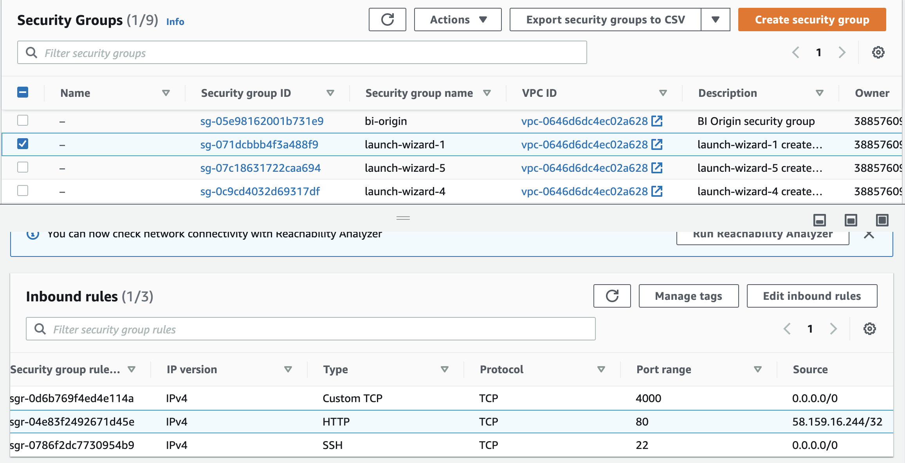
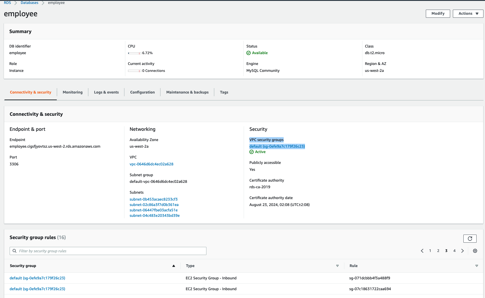

# aws-rds-s3-upimage-python 🐳


[](https://github.com/tquangdo/aws-rds-s3-upimage-python/issues/new)


## reference
[youtube](https://www.youtube.com/watch?v=7Gym2XVcA5A)

## ssh to ubuntu EC2
```shell
ssh -i "DTQUbuntu184_20220101.pem" ubuntu@ec2-54-213-116-161.us-west-2.compute.amazonaws.com
```
+ install & config
```shell
sudo apt-get update
sudo apt-get install mysql-client
sudo apt-get install python3 python3-pip python3-flask python3-pymysql python3-boto3
```
+ for running application
```shell
git clone https://github.com/tquangdo/aws-rds-s3-upimage-python.git
cd aws-rds-s3-upimage-python
sudo python3 EmpApp.py
 * Running on http://0.0.0.0:80/ (Press CTRL+C to quit)
 * Restarting with stat
 * Debugger is active!
 * Debugger PIN: 163-797-406
```

+ condition to access on browser: MUST open port 80 on `inbound rules`


## mysql
+ condition to connect RDS: tai thoi diem tao RDS thi phai chua SG cua EC2 tao sau do
> neu tao RDS xong roi tao EC2 voi SG moi thi phai tim cach add SG do vo RDS's SG rule
+

+ connect `$ mysql -h employee.cigsfjyovtsz.us-west-2.rds.amazonaws.com -u intellipaat -p`
```sql
create database employee;
use employee
create table employee(
    empid varchar(20),
    fname varchar(20),
    lname varchar(20),
    pri_skill varchar(20),
    location varchar(20)
);
```
+
```sql
show tables;
+--------------------+
| Tables_in_employee |
+--------------------+
| employee           |
+--------------------+
```

## deploy python in local
```shell
pip3 install flask pymysql boto3
```
+ `python3 EmpApp.py` will output this ERR because local can NOT connect to RDS
`pymysql.err.OperationalError: (2003, "Can't connect to MySQL server on 'employee.cigsfjyovtsz.us-west-2.rds.amazonaws.com' (timed out)")`

## aws deploy
1. 


